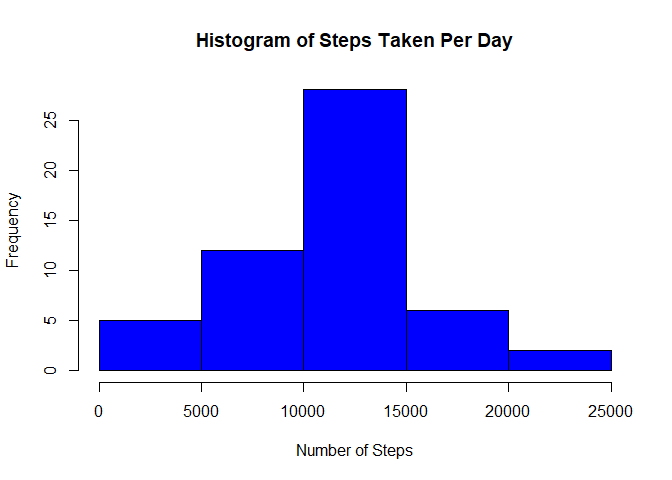
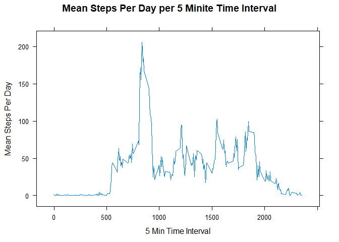
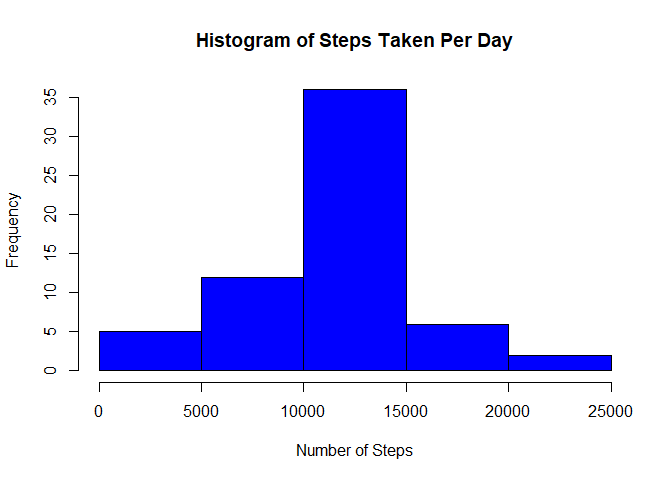
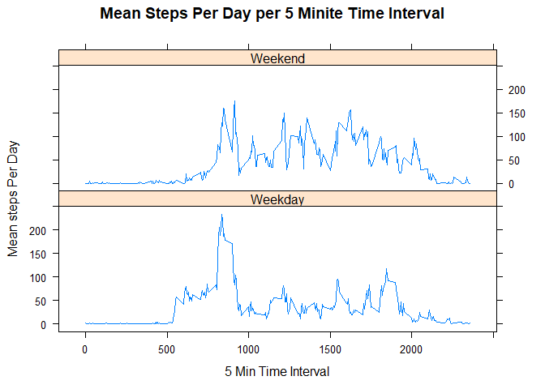

# Reproducible Research: Peer Assessment 1


Support Functions


```r
ReadDataWeb <- function()
{
        temp <- tempfile()
        download.file("https://d396qusza40orc.cloudfront.net/repdata%2Fdata%2Factivity.zip",temp)
        userdata <- read.csv(unz(temp, "activity.csv"))
        unlink(temp)   
        userdata
}
ReadDataLocal <- function()
{
        userdata <- read.csv("activity.csv")
        userdata
}

ReadData <- function()
{
     returndata <- ReadDataWeb()   
}


GroupByDate <- function(InCleanData)
{
  GroupByDate <- aggregate(InCleanData$steps, by = list(InCleanData$date), sum)
  colnames(GroupByDate) <- c("date","steps")
  GroupByDate
}
```

The data has some missing values represented as "NA"

```r
  library(knitr)
  userdata <- ReadData()
  kable(userdata[1:5,])
```


 steps  date          interval
------  -----------  ---------
    NA  2012-10-01           0
    NA  2012-10-01           5
    NA  2012-10-01          10
    NA  2012-10-01          15
    NA  2012-10-01          20


###Create a Histogram

```r
  userdata <- ReadData()
  grouped <- GroupByDate(userdata)
  hist(grouped$steps, main = "Histogram of Steps Taken Per Day", xlab = "Number of Steps", col="Blue")
```

<!-- -->

###Calculate the Mean and Median of each day

```r
  userdata <- ReadData()
  grouped <- GroupByDate(userdata)

 
 print (paste("The mean number of steps per day = ", format(round(mean(grouped$steps, na.rm=TRUE),2),nsmall=2)))
```

```
## [1] "The mean number of steps per day =  10766.19"
```

```r
 print (paste("The median number of steps per day = ", format(round(median(grouped$steps, na.rm=TRUE),2),nsmall=2)))
```

```
## [1] "The median number of steps per day =  10765.00"
```

###Create a Time Series Plot by date for each time series increment

```r
  library("lattice")

  userdata <- ReadData()

  bydate <- tapply(userdata$steps,userdata$interval, mean, na.rm=TRUE)
  bydateframe <- as.data.frame(bydate)
  
  colnames(bydateframe) <- c("mean.steps")
  bydateframe$interval <-  as.numeric(as.character(row.names(bydateframe)) )

  xyplot ( bydateframe$mean.steps ~ bydateframe$interval , type = "l", xlab = "5 Min Time Interval", ylab = "Mean Steps Per Day", main = "Mean Steps Per Day per 5 Minite Time Interval")
```

<!-- -->

```r
  maxsteps <- bydateframe[which(bydateframe$mean.steps == max(bydateframe$mean.steps)),]  ##just in case there are ties
  ##meanmax <-  as.character(maxsteps$mean.steps[[1]])
  
  print (paste("The maximum number is ", as.character(maxsteps$mean.steps[[1]]), " which occurs at interval ", as.character(maxsteps$interval[[1]]), "."))
```

```
## [1] "The maximum number is  206.169811320755  which occurs at interval  835 ."
```


###Missing Data Analysis 
Replace missing steps values with the mean from that interval averaged across days


```r
 userdata <- ReadData()
 print (paste ("The number of NAs in this data set = ", sum(is.na(userdata$steps)) ))
```

```
## [1] "The number of NAs in this data set =  2304"
```

```r
 ##calculate the mean per interval across multiple days
 bydate <- tapply(userdata$steps,userdata$interval, mean, na.rm=TRUE)
 bydateframe <- as.data.frame(bydate)
 colnames(bydateframe) <- c("mean.steps")
 bydateframe$interval <-  as.numeric(as.character(row.names(bydateframe)) )
 
 for (i in 1:nrow(userdata))
 {
         if (is.na(userdata[i,1]))
         {
                userdata[i,1] = bydateframe[bydateframe$interval ==as.numeric(userdata[i,3]),1] 
         }
 }


 ##Make sure we got all the NAs
 print (paste ("The number of NAs after replacemnt = ", sum(is.na(userdata$steps)) ))
```

```
## [1] "The number of NAs after replacemnt =  0"
```

```r
 ##create histogram of new dataset with NAs replaced
  grouped2 <- GroupByDate(userdata)
  head(userdata)
```

```
##       steps       date interval
## 1 1.7169811 2012-10-01        0
## 2 0.3396226 2012-10-01        5
## 3 0.1320755 2012-10-01       10
## 4 0.1509434 2012-10-01       15
## 5 0.0754717 2012-10-01       20
## 6 2.0943396 2012-10-01       25
```

```r
  hist(grouped2$steps, main = "Histogram of Steps Taken Per Day", xlab = "Number of Steps", col="Blue")
```

<!-- -->

```r
  print (paste("The mean number of steps per day = ", format(round(mean(grouped2$steps),2),nsmall=2)))
```

```
## [1] "The mean number of steps per day =  10766.19"
```

```r
  print (paste("The median number of steps per day = ", format(round(median(grouped2$steps),2),nsmall=2)))
```

```
## [1] "The median number of steps per day =  10766.19"
```


###Weekend vs Weekday Analysis

```r
  userdata <- ReadData()

  ##Add column with day of week
  userdata$day <- weekdays(as.Date(userdata$date))
  library(plyr)
  ##convert day of week to Weekend or Weekday and factorize
  userdata$day <- revalue (userdata$day, c("Monday"="Weekday", "Tuesday"="Weekday", "Wednesday"="Weekday", "Thursday"="Weekday", "Friday"="Weekday", "Saturday"="Weekend", "Sunday"="Weekend"))
  userdata$day = factor(userdata$day)
 
  ##group by the intersection of date and day then split the column of the intersection back into two columns
  bydate <- tapply(userdata$steps,interaction(userdata$interval,userdata$day), mean, na.rm=TRUE)
  bydateframe <- as.data.frame(bydate)
  colnames(bydateframe) <- c("mean.steps")
  library(stringr)
  bydateframe$interaction <- row.names(bydateframe)
  splitvals <-str_split_fixed(bydateframe$interaction, "\\.",2)
  colnames(splitvals) <- c("interval","day")
  bydateframe <- cbind(bydateframe,splitvals)  ##combine into one df
  bydateframe$interval <- as.numeric(as.character(bydateframe$interval))

##create the xyplot
  xyplot ( bydateframe$mean.steps ~ bydateframe$interval | bydateframe$day, type = "l", xlab = "5 Min Time Interval",     ylab = "Mean steps Per Day", main = "Mean Steps Per Day per 5 Minite Time Interval", layout=c(1,2))
```

<!-- -->


